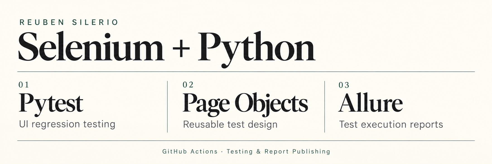

# Selenium QA Automation Portfolio

An automated UI regression suite by **Reuben Silerio**, built with **Python, Selenium WebDriver, Pytest, Page Object Model, Allure, and GitHub Actions**.

The project translates documented scenarios into automated checks against [Automation Exercise](https://automationexercise.com/), with a focus on repeatable execution, meaningful assertions, reusable page objects, explicit synchronization, and clear test evidence.

[View Live Allure Report](https://siler1o.github.io/selenium-qa-automation-portfolio/) · [Test Case Tracker](https://docs.google.com/spreadsheets/d/1E-rbgsHj4jv7pamglMdsREiQnfcl-aHWACqrRmAwD3w/edit?usp=drivesdk) · [Test Scripts](tests/) · [Latest Scenario: TC026](tests/test_TC026_Scroll_Up_Without_Arrow.py) · [About Reuben](https://github.com/siler1o)

## Coverage and Verified CI Snapshot

**All 26 planned scenarios are implemented** as of 29 September 2026. This completes the scenario roadmap; it does not represent application-wide test coverage.

| Evidence | Status |
| --- | --- |
| Implemented scenarios | TC001–TC026 |
| Local execution | All 26 passed, reported by the author on 29 September 2026 |
| Verified CI execution | [26 passed in 142.35 seconds](https://github.com/siler1o/selenium-qa-automation-portfolio/actions/runs/36897542904), commit `62398b5` — 2 October 2026 (PHT) |
| Report deployment | Allure generation and GitHub Pages deployment succeeded in the linked run |
| Reporting | Live workflow badge above; Allure results retained for 14 days |

The linked run confirms that all 26 tests passed, including TC016. This is a dated execution snapshot; use the live badge and [workflow history](https://github.com/siler1o/selenium-qa-automation-portfolio/actions/workflows/selenium-ci.yml) for subsequent results. The published Allure report reflects the most recent successful deployment.

The suite exercises account flows, catalog navigation, search, cart operations, checkout, product reviews, invoice downloads, and scrolling. CI runs on Ubuntu with Python 3.11 and headless Chrome.

## Automated Scenarios

| ID | Scenario | Main checks |
| --- | --- | --- |
| [TC-001](tests/test_TC001_Register.py) | Register user | Uses the reusable registration page object, generates a unique email, verifies account creation and the signed-in name, then deletes its test account. |
| [TC-002](tests/test_TC002_Valid_Login.py) | Valid login | Verifies the login form and confirms that valid credentials display the logged-in navigation indicator. |
| [TC-003](tests/test_TC003_Invalid_Login.py) | Invalid login | Verifies the exact invalid-credentials message and confirms that Signup / Login remains available. |
| [TC-004](tests/test_TC004_Logout_User.py) | Logout | Logs in and out, then verifies both the logged-out indicator and redirected login heading. |
| [TC-005](tests/test_TC005_Existing_Email.py) | Existing-email registration | Verifies the duplicate-email error and confirms that the signup form remains displayed on the /signup route. |
| [TC-006](tests/test_TC006_Contact.py) | Contact Us form | Validates the attachment path, submits the form, accepts the alert, checks the exact success message, and returns to the homepage. |
| [TC-007](tests/test_TC007_Test_Case.py) | Test Cases navigation | Verifies the Test Cases heading, expected text, and /test_cases destination. |
| [TC-008](tests/test_TC008_Products_Page.py) | Products and product details | Verifies the All Products heading, confirms that product cards are present, opens the first product, and validates its name, category, price, availability, condition, and brand. |
| [TC-009](tests/test_TC009_Product_Search.py) | Product search | Searches for `Blue Top`, verifies the Searched Products heading, requires at least one visible result, and checks that every returned product card contains the search phrase using a case-insensitive comparison. |
| [TC-010](tests/test_TC010_Subscription.py) | Homepage subscription | Verifies the homepage URL, scrolls to the subscription section, checks the heading is visible, submits a valid test email, and checks the visible confirmation message against the expected text. |
| [TC-011](tests/test_TC011_Subscription_Cart.py) | Cart-page subscription | Opens the Cart page, scrolls to its subscription section, submits a valid test email, and verifies the exact visible success message. |
| [TC-012](tests/test_TC012_Add_Products.py) | Add products to cart | Adds the first two listed products, verifies both product links are visible in the cart, compares cart unit prices with prices captured from the listing, checks quantity 1, and verifies each displayed total. |
| [TC-013](tests/test_TC013_Product_Quantity.py) | Product quantity in cart | Opens the first product, changes and verifies the quantity field as 4, adds the item, confirms the Cart route, compares the cart product name with the captured detail-page name, and verifies that quantity 4 is preserved. |
| [TC-014](tests/test_TC014_Order_Register.py) | Register during checkout | Adds a product before registration, resumes checkout, checks delivery and billing address values and order-review name/price/quantity, submits dummy payment details, verifies Order Placed, and deletes its account. |
| [TC-015](tests/test_TC015_Order_Register_Before_Checkout.py) | Register before checkout | Registers before shopping, verifies cart and order-review details and both address sections, places an order with dummy payment data, and deletes its account. |
| [TC-016](tests/test_TC016_Order_Login_Before_Checkout.py) | Login before checkout | Creates a dedicated account during setup, logs out and back in, validates cart and order-review details and both addresses, places an order, then deletes only that account. |
| [TC-017](tests/test_TC017_Remove_products.py) | Remove products from cart | Adds the first product, verifies its name, price, quantity and cart route, removes it, and confirms the empty-cart message. |
| [TC-018](tests/test_TC018_View_category_products.py) | View category products | Verifies category controls, navigates Women → Tops and Men → Tshirts, validates headings and routes, and confirms products are displayed. |
| [TC-019](tests/test_TC019_View_Brand_Products.py) | View brand products | Opens Products, verifies the Brands section, navigates Polo and H&M brand pages, validates headings and decoded routes, and confirms products are displayed. |
| [TC-020](tests/test_TC020_Search_Cart_After_Login.py) | Cart persistence after login | Captures all search results, adds them, and compares product IDs, names, prices, and quantities before and after login using a dedicated account. |
| [TC-021](tests/test_TC021_Add_Product_Review.py) | Product review | Verifies entered review-field values and the submission confirmation. |
| [TC-022](tests/test_TC022_Add_Recommended_Product.py) | Recommended product | Captures a visible recommendation and checks its ID, name, price, and quantity in the cart. |
| [TC-023](tests/test_TC023_Verify_Checkout_Addresses.py) | Checkout addresses | Compares complete normalized delivery and billing address lines with registration data, using distinct city, state, and country values. |
| [TC-024](tests/test_TC024_Download_Invoice.py) | Invoice download | Places an order, waits for a non-empty invoice file with no partial download remaining, and attaches the file to Allure. |
| [TC-025](tests/test_TC025_Scroll_Up_Arrow.py) | Scroll up with arrow | Verifies the footer is in the viewport, clicks the up-arrow, and checks the top position and banner visibility. |
| [TC-026](tests/test_TC026_Scroll_Up_Without_Arrow.py) | Scroll up without arrow | Scrolls programmatically and checks the footer, top position, and banner within the viewport. |

**Coverage boundaries:** TC-014 through TC-016 verify product name, unit price, and quantity at checkout; checkout line-total and overall order-total assertions remain pending. TC-014's delivery-address check currently omits state and postcode; its billing check includes them. TC014–TC016 use normalized text containment; TC023–TC024 compare complete normalized address lines. TC020 verifies cart persistence for the returned results, not independent search relevance or completeness. TC021 verifies a confirmation message, not persistent review storage. TC024 verifies file completion and size, not invoice content correctness. A passing run covers the assertions implemented in code, not every planned tracker check.

## Implementation Highlights

- **Reusable UI architecture:** page objects own locators, explicit waits, and browser actions; tests own workflow assertions.
- **Dynamic expectations:** product names, IDs, and prices are captured before cart comparisons, including multi-item checks across login.
- **Account isolation:** registration and checkout scenarios use UUID emails; TC016 and TC020 create their own login accounts.
- **Address validation:** TC023 and TC024 compare ordered address lines against distinct registration values.
- **Download evidence:** TC024 uses an isolated temporary directory, checks download completion, and attaches the invoice to Allure.
- **Viewport validation:** TC025 and TC026 measure scroll position and element bounds rather than relying only on element visibility.
- **Automated reporting:** GitHub Actions runs headless Chrome, retains raw results, and gates Allure deployment on a successful main-branch test job.

## Project Organization

| Location | Responsibility |
| --- | --- |
| [tests/](tests/) | Test workflows, expected-result assertions, and Allure steps. |
| [pages/home_page.py](pages/home_page.py) | Homepage navigation, product capture, recommendations, category navigation, scrolling, and viewport checks. |
| [pages/login_page.py](pages/login_page.py) | Login, signup, logout, authentication messages, and subscription interactions. |
| [pages/registration_page.py](pages/registration_page.py) | Account information, address entry, preferences, account confirmations, signed-in name, and test-account deletion. |
| [pages/contact_us.py](pages/contact_us.py) | Contact form fields, attachment upload, alert handling, success message, and home navigation. |
| [pages/navigation_bar.py](pages/navigation_bar.py) | Reusable navigation to Products, Test Cases, and Cart. |
| [pages/products_page.py](pages/products_page.py) | Product listing, search, quantity input, cart interactions, checkout, delivery/billing address access, payment form entry, reviews, invoice download, and order confirmation. |
| [conftest.py](conftest.py) | Shared Chrome setup, CI-only headless options, third-party ad-request blocking, an isolated download-directory fixture, and browser teardown. |
| [.github/workflows/selenium-ci.yml](.github/workflows/selenium-ci.yml) | GitHub Actions CI/CD pipeline for test execution, Allure artifacts, and gated report deployment. |
| [test_data/](test_data/) | Sample attachment used by TC-006. |
| [requirements.txt](requirements.txt) | Python dependencies required by the project. |
| [docs/](docs/) | Legacy generated report files; current GitHub Pages publication uses the CI deployment artifact. |
| [.gitignore](.gitignore) | Excludes the virtual environment, caches, and local report output. |

Page objects handle locating and interacting with UI elements. Tests describe the business workflow and evaluate returned elements against expected results.

## Setup

The recorded local environment uses Python 3.11.4 and Google Chrome on Windows. Install Python, Chrome, and Git before starting. Internet access to the practice website is required.

From PowerShell:

~~~powershell
git clone https://github.com/siler1o/selenium-qa-automation-portfolio.git
cd selenium-qa-automation-portfolio
python -m venv .venv
./.venv/Scripts/Activate.ps1
python -m pip install -r requirements.txt
~~~

If PowerShell blocks activation, use ./.venv/Scripts/python.exe instead of python for the install and test commands; no execution-policy change is necessary.

### Test Data and Preconditions

#### Environment and browser setup

Install the dependencies in `requirements.txt` and have Google Chrome available. Tests access the public Automation Exercise website and require a working internet connection.

The function-scoped [`driver` fixture](conftest.py) creates a fresh Chrome session for each test and closes it during teardown. Local runs show the browser; runs with the `CI` environment variable use headless Chrome at 1920 × 1080. The fixture disables profile/card autofill and blocks selected third-party advertising domains to reduce interruptions.

#### Accounts and cleanup

| Scenarios | Account requirement | Setup and cleanup |
| --- | --- | --- |
| [TC002](tests/test_TC002_Valid_Login.py), [TC004](tests/test_TC004_Logout_User.py), [TC005](tests/test_TC005_Existing_Email.py) | The existing practice account referenced in these scripts must already exist. TC002 and TC004 also require its matching password. | These tests do not create or delete the account. TC005 uses its email for duplicate-registration validation. |
| TC001, TC014–TC016, TC020, TC023, TC024 | Each test generates a unique `reuben.qa.<uuid>@example.com` address. | Registration is performed within the test, and account deletion occurs at the end of the successful flow. |
| TC016 and TC020 | Each creates its own account before the main login-dependent flow. | Setup registers the account and logs out; the test later logs back in using those same credentials. Neither requires TC001 to run first. |

The fixed account used by TC002/TC004/TC005 is separate from the dynamically generated accounts. Account data is currently defined in the test scripts, not loaded from environment variables or GitHub secrets.

Browser teardown and account cleanup are separate: the fixture closes Chrome after a test failure, but an earlier failed assertion can prevent the test's final account-deletion step from running. Cleanup after failure is still a maintenance item.

#### Files, catalog data, and form inputs

| Scenarios | Data or precondition | What the test verifies |
| --- | --- | --- |
| [TC006](tests/test_TC006_Contact.py) | `test_data/attachment test.png` must exist. The script resolves it relative to the repository root. | Attachment path exists; the contact form can be submitted and its success message is displayed. |
| [TC008](tests/test_TC008_Products_Page.py) | Product ID 1 is expected to be **Blue Top**, category **Women > Tops**, price **Rs. 500**, available **In Stock**, condition **New**, brand **Polo**. | The product route, title, and those displayed details. Catalog changes may require updating these fixed expectations. |
| [TC009](tests/test_TC009_Product_Search.py) | Search term: `Blue Top`. | At least one result is returned, and every returned product card contains the term, ignoring case. |
| TC010–TC011 | A fixed dummy email is entered into the subscription form. | On-page subscription confirmation; email delivery and persistent storage are outside these checks. |
| [TC012](tests/test_TC012_Add_Products.py) | Products 1 and 2 are added once in a fresh browser session. Their listing prices are captured during the run. | Both product links, matching prices, quantity 1, and displayed row totals. |
| [TC013](tests/test_TC013_Product_Quantity.py) | Product ID 1; requested quantity `4`. The product name is captured from its details page. | The quantity input, cart product name, and preserved quantity. |
| TC014–TC016, TC023–TC024 | Dummy registration/address data is defined in each script. Order-placement tests also use dummy payment values. | The implemented address and checkout assertions; order confirmation does not validate real payment settlement. |
| [TC020](tests/test_TC020_Search_Cart_After_Login.py) | Search term: `top`. Product IDs, names, prices, and quantities are captured from the returned results. | Selected cart contents remain consistent before and after login; results need not have a fixed count. |
| [TC024](tests/test_TC024_Download_Invoice.py) | The `download_dir` fixture creates an isolated folder using Pytest's `tmp_path` and configures Chrome to download there. | A nonempty `invoice.txt` appears within 30 seconds with no `.crdownload` or `.tmp` files remaining; the file is attached to Allure. Invoice contents are not yet asserted. |

Use the linked scripts for the exact data and assertions. Search checks do not independently prove catalog completeness, and public-site availability or catalog changes can affect execution.

## Run the Tests

Run the complete suite:

~~~powershell
python -m pytest tests/ -v
~~~

Run an individual scenario:

~~~powershell
python -m pytest tests/test_TC016_Order_Login_Before_Checkout.py -v
~~~

Check test discovery without opening browsers:

~~~powershell
python -m pytest tests/ --collect-only -q
~~~

### Publish the Allure Report through CI/CD

The [Selenium CI/CD workflow](.github/workflows/selenium-ci.yml) is the primary publishing path:

1. A push or pull request targeting `main` starts the test job.
2. GitHub installs Python 3.11 dependencies and runs the complete suite in headless Chrome.
3. Raw `allure-results` are uploaded as a downloadable artifact for 14 days, even if a test fails.
4. For a successful push to `main`, Allure CLI 3.16.0 generates and verifies the HTML report.
5. GitHub Pages receives the report only after the test job passes.

Pull requests perform CI validation but never deploy. The workflow can also be started from the Actions tab with **Run workflow** on `main`.

Repository administrators must select **Settings → Pages → Build and deployment → Source → GitHub Actions** once. After that one-time setting, report generation, validation, and publication require no manual `docs/` commit.

[Open the workflow history](https://github.com/siler1o/selenium-qa-automation-portfolio/actions) · [Open the published Allure report](https://siler1o.github.io/selenium-qa-automation-portfolio/).

Optional: preview reports locally

Use this when investigating a local run before pushing. CI generates and publishes its own report automatically; these steps are not required for deployment. Install Allure CLI 3.16.0 separately to use the commands below.

### Generate Allure Results

Generate fresh raw results for the full suite:

~~~powershell
python -m pytest tests/ -v --alluredir=allure-results --clean-alluredir
~~~

The Python integration records the result files; the separate Allure CLI builds the HTML report. The command above clears previous local results in `allure-results/`. CI stores its own raw-results artifact for 14 days.

### Generate and Preview an Allure 3 Report

The documented CLI version is 3.16.0. Use `generate` and `open`, following the [Allure 3 generation](https://allurereport.org/docs/v3/generate-report/) and [viewing](https://allurereport.org/docs/v3/view-report/) guides. Do not add the Allure 2 `--clean` flag.

Run from the repository root in PowerShell. Generate into a fresh temporary folder so old report files cannot be mixed with the new run:

~~~powershell
$qaReportBuild = Join-Path ([IO.Path]::GetTempPath()) ("qa-allure-" + [guid]::NewGuid().ToString("N"))
allure.cmd generate ".\allure-results" -o $qaReportBuild
if ($LASTEXITCODE -ne 0) { throw "Allure generation failed." }

$qaReportSource = $qaReportBuild
if (Test-Path (Join-Path $qaReportBuild "awesome\index.html")) {
    $qaReportSource = Join-Path $qaReportBuild "awesome"
}

if (-not (Test-Path (Join-Path $qaReportSource "index.html"))) {
    throw "Generated report index.html was not found."
}
Get-Content (Join-Path $qaReportSource "widgets\statistic.json") -ErrorAction Stop
~~~

Compare the displayed totals with the actual Pytest run. The current suite contains 26 scenarios; confirm that all intended tests appear and review any failures before using the report as evidence:

~~~powershell
allure.cmd open $qaReportSource
~~~

Press Ctrl+C to stop the local preview server. This does not delete the results or report files.

### Optional pytest-html Summary

~~~powershell
python -m pytest tests/ -v --html=report.html --self-contained-html
~~~

This creates a separate pytest-html summary rather than the step-level Allure report. Generated report.html, assets/, allure-results/, and allure-report/ output are excluded from Git tracking.

## Test Documentation

The [Reuben Selenium Test Case Tracker](https://docs.google.com/spreadsheets/d/1E-rbgsHj4jv7pamglMdsREiQnfcl-aHWACqrRmAwD3w/edit?usp=drivesdk) contains the planned scenarios, priorities, detailed actions, test data, expected results, actual results, and execution history. Scenario IDs connect that manual documentation to the automated scripts.

## Current Scope and Next Steps

The TC001–TC026 implementation roadmap is complete. The next phase focuses on reliability, stronger assertions, and maintenance:

- Monitor CI reliability and investigate any recurring timeouts or practice-site availability issues.
- Guarantee test-account cleanup after failures.
- Attach failure screenshots, browser details, and page state to Allure.
- Add checkout line-total and overall order-total assertions.
- Extend the stricter address checks to earlier checkout tests.
- Validate invoice contents and add search edge cases and independent relevance checks.
- Consolidate repeated account setup and shared test data.

### Execution Scope

Tests target Chrome against the public Automation Exercise practice application. Dummy payment data validates UI order confirmation, not real payment settlement. The existing account referenced by TC002, TC004, and TC005 must remain available. Generated-account cleanup currently occurs at the end of successful flows.

The Selenium workflow deploys Allure after successful main-branch runs. Configure GitHub Pages to use **GitHub Actions** as its source; the repository also has a separate Pages build workflow in its run history, so its success is not evidence that Selenium tests passed.

## Acknowledgements

Thanks to [Automation Exercise](https://automationexercise.com/) for providing a public QA practice website and [test-case scenarios](https://automationexercise.com/test_cases).
